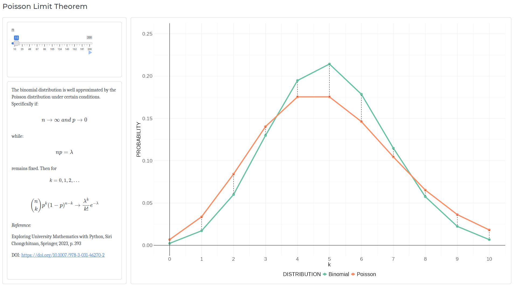

## Poisson Limit Theorem

### Poisson and Binomial Distributions

Probability mass functions of Binomial and Poisson distributions respectively:

$$Pr(X=k)=\binom{n}{k}p^{k}q^{n-k}$$

$$Pr(X=k)=\lambda^{k}\frac{\mathrm{e}^{-\lambda}}{k!}$$

Where $n$ is the number of independent trials and $p$ is the probability of

success of a trial and $\lambda$ is the parameter of the Poisson distribution.

### Theorem

If $n\rightarrow\infty$ and $p\rightarrow0$ and the product of $n$ and $p$

remains fixed and equal to $\lambda$ then the Binomial distribution is well

approximated by the Poisson distribution with parameter $\lambda=np$.

### Shiny App

In this Shiny app, the number of trials is controlled by a slider input which

takes values from 10 to 1000. Behind the scenes the value of $p$ changes so that

the product $np$ remains fixed and equal to $\lambda$ which here is 5. As the

number of trials grows larger the Binomial distribution converges to the
Poisson

distribution, as shown in the plot on the right.

A screenshot of the app:

